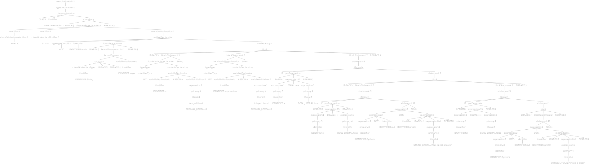

# Task 1

## Description
In this task we are required to take a java file as an input and output a
modified intermediate java file (injected code) where:

we add a comment in each block of this code indicates the number of this block


## Starting Rule
```java
compilationUnit
    : packageDeclaration? importDeclaration* typeDeclaration*
    | moduleDeclaration EOF
    ;
```

By Generating Antler Recognizer we will have a `JavaParserBaseVisitor.java` file
in which there are two main functions needed to solve this task

```java
public T visitClassBody(JavaParser.ClassBodyContext ctx) { return visitChildren(ctx); }

public T visitBlock(JavaParser.BlockContext ctx) { return visitChildren(ctx); }
```

The First we will be modifying to capture all classes' blocks and the second will be modified to capture any other block inside the class 

## Procedure
The file `MyVisitorParser.java` holds all the functionality of capturing occurrences of all kinds of blocks
for example:

```java
public String visitBlock(JavaParser.BlockContext ctx) {
    try {
        rewriter.insertAfter(ctx.getStart(),"// block number"+count);
        ++count;

    } catch (Exception e) {
        e.printStackTrace();
    }

    return super.visitBlock(ctx);
}
```
The previous function will override the generated `visitBlock` function, and it works as follows:
- the `ctx.getStart()` function captures the `{` at the start of the block.
- then `rewriter.insertAfter()` function is used to overwrite the input file and appends the block number after the `{`.
- then a general counter, that follows the current count of captured blocks, is increased by one.

... the same goes for `visitClassBody` function declaration

## Tests
> Input:
```java
class Task01 {
    public static void main(String[] args) {
        int x = 0;
        int expression = 9;
        if( x == true ) {

            if ( x == true)
                System.out.println("this is not a block");

            if (z  == false){
                System.out.println("this is a block");
            }
        }
    }
}
```

> Output
```java
class Task01 {                                  // block number0
    public static void main(String[] args) {    // block number1
        int x = 0;
        int expression = 9;
        if( x == true ) {                       // block number2

            if ( x == true)
                System.out.println("this is not a block");

            if (z  == false){                   // block number3
                System.out.println("this is a block");
            }
        }
    }
}
```
> Antler Parse Tree

