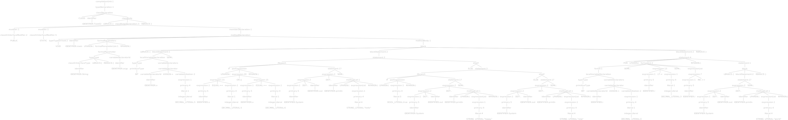

# Task 2

## Description
In this task we are required to take a java file as an input and output a
modified intermediate java file (injected code) where:

each block we defined in the previous task now needs to be marked if visited

## Grammer Used
By Generating Antler Recognizer we will have a `JavaParserBaseVisitor.java` file
in which the following functions we are going to modify. 

```java
public T visitCompilationUnit(JavaParser.CompilationUnitContext ctx) { return visitChildren(ctx); }

public T visitClassBody(JavaParser.ClassBodyContext ctx) { return visitChildren(ctx); }

public T visitBlock(JavaParser.BlockContext ctx) { return visitChildren(ctx); }

public T visitIfbranch(JavaParser.IfbranchContext ctx) { return visitChildren(ctx); }

public T visitElseif(JavaParser.ElseifContext ctx) { return visitChildren(ctx); }

public T visitMethodDeclaration(JavaParser.MethodDeclarationContext ctx) { return visitChildren(ctx); }
```

## Procedure
- First we initialize a `public ArrayList` and a `public integer array`.
- With each block initialization we inject the code `arrayList.add( block_number );` 
- The previous code will be executed whenever a block is executed, hence we can monitor visited block and the count of how much they were executed.
- By the end of  the class we inject a for loop to print all the saved blocks' number inside the arraylist

## Tests
> Input:
```java
class Task02 {
    public static void main(String[] args) {
        int x = 5;
        if(x == 5 || x == 6)
            System.out.println("hello");
        else if(true)
            System.out.println("happy");
        else
            System.out.println("new");
        for(int i = 0 ; i < 3  ;i++)
        {
            System.out.println("world");
        }
    }
}
```

> Output
```java
import java.util.*;
class Task02 {

    static public Integer blocksVisited[] = {};
    static public ArrayList<Integer> arrayList = new ArrayList<Integer>(Arrays.asList(blocksVisited));

    public static void main(String[] args) {		// block number 1
        arrayList.add(1);
        int x = 5;
        if(x == 5 || x == 6)
        {						// block number 2
            arrayList.add(2);
            System.out.println("hello");
        }
        else if(true)
        {						// block number 3
            arrayList.add(3);
            System.out.println("happy");
        }
        else
        {						// block number 4
            arrayList.add(4);
            System.out.println("new");
        }
        for(int i = 0 ; i < 3  ;i++)
        {		                                // block number 5
            arrayList.add(5);
            System.out.println("world");
        }

        blocksVisited = arrayList.toArray(blocksVisited);
        for(int blockNums: blocksVisited)
        {
            if(blockNums != 0)
                System.out.println("Block #"+blockNums+" is visited");
        }
    }
}
```
> Antler Parse Tree

